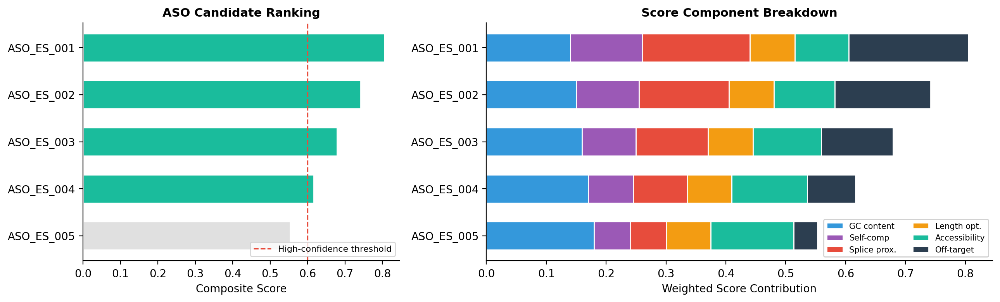
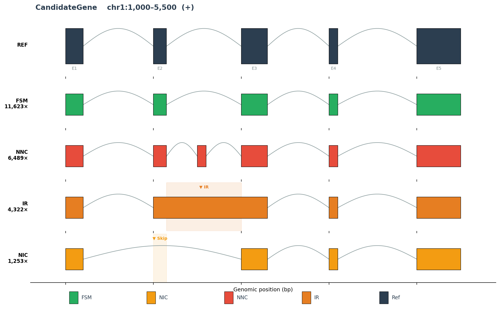

# splicetarget

**Long-read splice isoform analysis and antisense oligonucleotide (ASO) target nomination for personalized therapeutic design.**

[](https://www.python.org/downloads/)
[](LICENSE)
[]()
[](notebooks/02_real_data_walkthrough.ipynb)

---

## Overview

`splicetarget` is an end-to-end pipeline that converts PacBio IsoSeq or ONT direct-RNA long-read data into actionable antisense oligonucleotide (ASO) therapeutic targets. It is designed for the N-of-1 rare disease setting where a patient's aberrant splicing must be characterized and a splice-switching therapy nominated.

**Pipeline stages:**

```
Raw Long Reads (IsoSeq / dRNA)
        │
        ▼
┌─────────────────────┐
│  1. Alignment        │  minimap2 splice-aware alignment
│     (splice-aware)   │  PacBio HiFi / ONT presets
└─────────┬───────────┘
          ▼
┌─────────────────────┐
│  2. Isoform Analysis │  Collapse → Classify (SQANTI3-style)
│     FSM/ISM/NIC/NNC  │  FSM, ISM, NIC, NNC, IR categories
└─────────┬───────────┘
          ▼
┌─────────────────────┐
│  3. Splicing Events  │  Exon skipping, cryptic exons,
│     Detection        │  intron retention, alt 5'/3' SS
└─────────┬───────────┘
          ▼
┌─────────────────────┐
│  4. ASO/SSO Design   │  Candidate generation (18-25nt)
│     & Scoring        │  Multi-criteria scoring + off-target
└─────────┬───────────┘
          ▼
┌─────────────────────┐
│  5. Report &         │  Sashimi plot + ranked target table
│     Visualization    │  JSON results + CSV candidates
└─────────────────────┘
```

## Key Features

- **Full isoform resolution** — Leverages long-read sequencing to capture complete transcript structures without assembly artifacts
- **SQANTI3-style classification** — Categorizes patient isoforms as Full Splice Match (FSM), Incomplete Splice Match (ISM), Novel In Catalog (NIC), Novel Not in Catalog (NNC), or Intron Retention (IR)
- **Five aberrant event types** — Detects exon skipping, cryptic exon inclusion, intron retention, alternative 5' splice sites, and alternative 3' splice sites
- **ASO target nomination** — Generates and scores candidate antisense oligonucleotide binding sites for each event, considering GC content, self-complementarity, splice site proximity, off-target homology, and RNA accessibility
- **Therapy-aware design** — Different ASO strategies per event type: exon inclusion (block ESS), exon exclusion (mask cryptic SS), splice site blocking, and intron splicing enhancement
- **Publication-quality visualization** — Sashimi-style splice plots with reference gene model, patient isoforms, event annotations, and ASO target sites
- **Multi-platform support** — PacBio IsoSeq (HiFi), PacBio cDNA, ONT direct-RNA, ONT cDNA

## Installation

```bash
# From source
git clone https://github.com/patrickgrady/splicetarget.git
cd splicetarget
pip install -e ".[dev]"

# Or via conda (recommended for bioinformatics dependencies)
conda env create -f env.yml
conda activate splicetarget
```

**External dependencies:** minimap2 ≥ 2.26, samtools ≥ 1.18 (installed via conda or separately)

## Quick Start

```bash
# Full pipeline: reads → isoforms → events → ASO candidates
splicetarget run \
    --reads patient_isoseq.bam \
    --reference GRCh38.fa \
    --annotation gencode.v44.annotation.gtf \
    --gene DMD \
    --outdir results/patient_001/

# Alignment only
splicetarget align \
    --reads patient.fastq \
    --reference GRCh38.fa \
    --output aligned.bam \
    --read-type isoseq

# Alignment QC stats
splicetarget stats --bam aligned.bam
```

## Output Files

| File | Description |
|------|-------------|
| `{GENE}_results.json` | Structured pipeline results (isoform counts, events, candidates) |
| `{GENE}_aso_candidates.csv` | Ranked ASO candidate table with all scoring dimensions |
| `{GENE}_sashimi.png` | Sashimi-style splice visualization |

### Clinical Report Markdown Example


| Metric | Value |
|--------|-------|
| **Gene** | CandidateGene (chr1:1,000-5,500) |
| **Total reads** | 23,687 |
| **Unique isoforms** | 4 |
| **Known isoforms (FSM/ISM)** | 1 |
| **Novel isoforms (NIC/NNC/IR)** | 3 |
| **Aberrant expression** | 45.6% of gene expression |
| **Aberrant events detected** | 4 |
| **Therapy-candidate isoforms** | 2 |
| **ASO candidates generated** | 5 |
| **High-confidence ASOs** | 4 (score ≥ 0.6, off-targets ≤ 3) |

**Interpretation:** 46% of gene expression derives from aberrant splice forms (NNC, IR). 4 actionable splicing event(s) were detected. 5 ASO candidates were nominated, of which 4 met the high-confidence threshold for experimental validation.

### ASO Ranking Plot Example



### Gene / Isoform Model Example



## ASO Scoring Criteria

Each candidate ASO is scored on multiple dimensions (0–1 scale):

| Criterion | Weight | Description |
|-----------|--------|-------------|
| GC content | 0.20 | Proximity to optimal 50% GC (affects binding affinity) |
| Self-complementarity | 0.15 | Low hairpin formation potential |
| Splice proximity | 0.20 | Distance to target splice site (closer = better) |
| Length optimality | 0.10 | Proximity to optimal 20nt length |
| RNA accessibility | 0.15 | Target site accessibility (ViennaRNA-based) |
| Off-target penalty | 0.20 | Fewer transcriptome off-target hits = better specificity |

## Therapeutic Strategies by Event Type

| Aberrant Event | ASO Strategy | Mechanism |
|----------------|-------------|-----------|
| Exon skipping | Exon inclusion | Block exonic splicing silencers (ESS) to restore skipped exon |
| Cryptic exon | Exon exclusion | Mask aberrant splice sites to prevent cryptic exon inclusion |
| Intron retention | Splicing enhancement | Mask retention-promoting elements near splice sites |
| Alt 5'/3' SS | Splice site block | Block activated cryptic splice site to restore canonical splicing |

## Configuration

Customize pipeline parameters via YAML config:

```yaml
# configs/pipeline.yaml
isoforms:
  junction_tolerance: 10
  min_reads: 2

aso_design:
  min_length: 18
  max_length: 25
  gc_optimal: 0.50
  top_n: 20

scoring:
  gc_content: 0.20
  off_target_penalty: 0.20
```

```bash
splicetarget run --config configs/pipeline.yaml --reads patient.bam ...
```

## Project Structure

```
splicetarget/
├── splicetarget/
│   ├── cli.py                  # CLI entry point (Click)
│   ├── data/
│   │   ├── io.py               # BAM/FASTA/FASTQ ingestion, junction extraction
│   │   └── reference.py        # GENCODE/Ensembl annotation parsing
│   ├── alignment/
│   │   └── aligner.py          # minimap2 splice-aware alignment wrapper
│   ├── isoforms/
│   │   ├── collapse.py         # Isoform collapsing (junction chain clustering)
│   │   ├── classify.py         # SQANTI3-style structural classification
│   │   └── quantify.py         # Isoform expression quantification
│   ├── splicing/
│   │   └── events.py           # Aberrant splicing event detection
│   ├── therapeutic/
│   │   ├── aso_design.py       # ASO candidate generation & scoring
│   │   ├── scoring.py          # Multi-criteria ranking & DataFrame export
│   │   └── offtarget.py        # BLAST-based off-target assessment
│   ├── visualization/
│   │   └── sashimi.py          # Sashimi-style splice plots (matplotlib)
│   └── utils/
│       └── genome.py           # Coordinate utilities, sequence helpers
├── configs/
│   └── pipeline.yaml           # Default pipeline configuration
├── tests/                      # pytest test suite
├── notebooks/                  # Analysis notebooks
├── Dockerfile                  # Containerized deployment
├── Makefile                    # Dev commands
└── pyproject.toml              # Package metadata & dependencies
```

## Testing

```bash
make test          # run test suite
make test-cov      # with coverage report
make lint          # ruff + mypy
```

## Docker

```bash
docker build -t splicetarget:latest .
docker run -v /data:/data splicetarget:latest run \
    --reads /data/patient.bam \
    --reference /data/GRCh38.fa \
    --annotation /data/gencode.gtf \
    --gene SMN2
```

## Biological Context

This tool is designed for the personalized medicine workflow where:

1. A patient with a suspected splicing disorder undergoes long-read RNA sequencing (PacBio IsoSeq or ONT dRNA-seq)
2. Full-length transcript isoforms are resolved without the limitations of short-read splice junction inference
3. Aberrant splicing events are identified by comparison to the reference transcriptome
4. Antisense oligonucleotide (ASO) or splice-switching oligonucleotide (SSO) candidates are computationally designed to correct the splicing defect
5. Top candidates are nominated for experimental validation and therapeutic development

This approach is particularly relevant for:
- **Duchenne muscular dystrophy (DMD)** — exon skipping therapy (cf. eteplirsen, golodirsen)
- **Spinal muscular atrophy (SMA)** — splice switching to increase SMN2 exon 7 inclusion (cf. nusinersen)
- **Rare splice-site mutations** — N-of-1 therapeutic design for individual patients

## License

MIT License — see [LICENSE](LICENSE)
